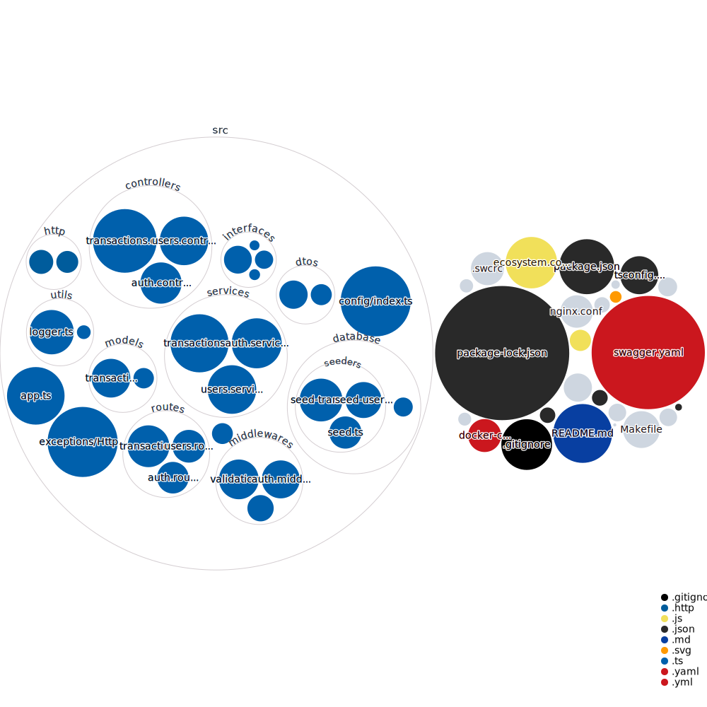

# FinTrack

FinTrack is a financial tracking application built with TypeScript, Express, and MongoDB. It provides endpoints for managing user accounts, tracking expenses, generating financial reports, and more.

## Features

- User authentication and authorization
- CRUD operations for transactions
- Monthly financial reports
- Swagger API documentation

## Technologies

- TypeScript
- Express
- MongoDB
- Docker
- Swagger


## Visualization of this repo



## Getting Started

### Prerequisites

- Node.js
- Docker

### Installation

1. Clone the repository:
   ```bash
   git clone https://github.com/codeyzx/fintrack.git
   cd fintrack
   ```

2. Install dependencies:
   ```bash
   npm install
   ```

3. Create a `.env` file and configure your environment variables:
   ```env
   NODE_ENV=development
   PORT=3000
   MONGO_URI=mongodb://localhost:27017/fintrack
   LOG_FORMAT=dev
   ORIGIN=*
   CREDENTIALS=true
   ```

### Running the Application

#### Using Docker

1. Build and run the Docker containers:
   ```bash
   make up
   ```

2. Access the application at `http://localhost:3000`.

#### Without Docker

1. Start the MongoDB database:
   ```bash
   docker-compose up -d mongo
   ```

2. Start the application:
   ```bash
   npm run dev
   ```

3. Access the application at `http://localhost:3000`.

### API Documentation

The API documentation is available at `http://localhost:3000/api-docs`.

### API Routes

#### Auth

- `POST /auth/signup` - Register a new user
- `POST /auth/login` - Login a user
- `POST /auth/logout` - Logout a user

#### Transactions

- `GET /transactions` - Get all transactions for the authenticated user
- `GET /transactions/:id` - Get a transaction by ID
- `POST /transactions` - Create a new transaction
- `PUT /transactions/:id` - Update a transaction by ID
- `DELETE /transactions/:id` - Delete a transaction by ID

#### Reports

- `GET /reports/monthly` - Get a monthly report for the authenticated user

### Running Tests

To run tests, use the following command:
```bash
npm test
```

## Project Structure

```
FinTrack/
├── src/
│   ├── controllers/
│   ├── interfaces/
│   ├── middlewares/
│   ├── models/
│   ├── routes/
│   ├── services/
│   ├── utils/
│   ├── app.ts
│   ├── server.ts
├── .env
├── docker-compose.yml
├── Dockerfile
├── Makefile
├── package.json
└── README.md
```

## Contributing

Contributions are welcome! Please follow these steps:

1. Fork the repository.
2. Create a new branch (`git checkout -b feature-branch`).
3. Make your changes.
4. Commit your changes (`git commit -m 'Add some feature'`).
5. Push to the branch (`git push origin feature-branch`).
6. Open a pull request.

## License

This project is licensed under the MIT License.
